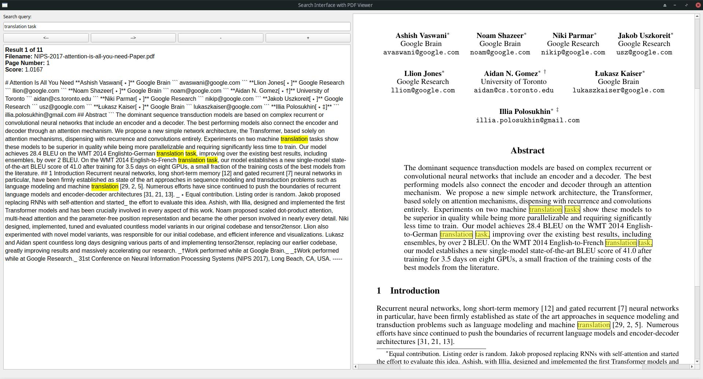

# PDF Knowledge Base Builder and Search Interface

This repository provides a suite of Python scripts to create a searchable knowledge base from PDF files, enabling efficient and intuitive text search with or without embeddings. The primary focus is simplicity and portability, avoiding the need for a formal database while offering advanced search capabilities.

Main interface



Data folders


---

## News

- Windows and Linux binaries are available now! Please see the [Releases](https://github.com/Topping1/BM25-PDF-Search/releases) section.
- Now the user can specify and manage which folders to load at runtime. List of folders is saved in the file `folders.ini`

---

## Features
- Extracts text from PDFs and saves them as JSON files.
- Supports embedding generation for enhanced search capabilities.
- Includes a GUI with search, navigation, and visualization of search results.
- Optional integration with the `fastembed` library for embedding-based search.
- Allows opening search results in an external PDF viewer (Okular by default).
- Tested in Linux and Windows 10

---

## Installation

### Requirements
Install the required libraries:
```bash
pip install pymupdf4llm
pip install PyQt5
pip install bm25s
```

#### Optional Libraries
To enable embedding-based search:
```bash
pip install fastembed
```

**Pros of using `fastembed`:**
- Enables embedding-based search for semantic relevance.
- Supports reranking with embeddings.

**Cons if `fastembed` is not installed:**
- Only BM25 and simple text search methods are available.

#### External Dependency
The script assumes the **Okular PDF viewer** is installed on your system. If not, install it using your package manager (e.g., `sudo apt install okular` on Ubuntu).

---

## Workflow

### 1. Minimum Workflow (JSON files only)
- Run `chunk-pdf-pages.py` to extract text from PDFs into JSON files. This is usually a long process but it needs to be done only once.
- Use the `BM25-String-Embed-Rerank-PDF-Search.py` script to search the JSON files using BM25 or simple text search.

### 2. Recommended Workflow (JSON + EMB files)
- Run `chunk-pdf-pages.py` to create JSON files from PDFs. This is usually a long process but it needs to be done only once.
- Run `create-JSON-embedding.py` to generate EMB files containing text embeddings for each page. This is usually a long process but it needs to be done only once.
- Use `BM25-String-Embed-Rerank-PDF-Search.py` for full search functionality, including embedding-based search and reranking.

---

## Scripts Overview

### `chunk-pdf-pages.py`
- Extracts text from PDF files into JSON format, chunked by pages.
- Outputs one JSON file per PDF, named after the original PDF.
- The script checks for already processed PDFs, so if the user adds more PDFs to a folder, running the script again will only add the missing JSON files.

### `create-JSON-embedding.py`
- Generates embeddings for the text in JSON files using `fastembed`.
- Produces `.emb` files corresponding to the JSON files. These contain embeddings but exclude text for reduced size.
- The script checks for already processed JSON files, so if the user adds more PDFs and processes them into JSON files, running the script again will only add the missing EMB files.

### `count tokens-words.py` (not required for the workflow)
- Analyzes JSON files to calculate statistics like word count, token count, and token distribution.
- Outputs summaries and ASCII histograms for insights into document structure.

### `BM25-String-Embed-Rerank-PDF-Search.py`
- Main GUI application for searching the knowledge base.
- Supports BM25, simple text search, and embedding-based search (if EMB files are available and `fastembed` is installed).
- Allows opening search result pages in the external PDF viewer for easier browsing.

---

## GUI Usage

### Components
1. **Search Input Box**: Type your search keywords here. Press `Enter` to execute the search.
2. **Text Results Box**: Displays the most relevant text, including:
   - Filename
   - Page number
   - Relevance score
3. **PDF Viewer**: Displays the corresponding PDF page with highlighted keywords.
4. **Dropdown Boxes**:
   - **Search Method**: Select one of the following methods:
     - **BM25**: Default search using BM25.
     - **Simple Text Search**: Searches for exact keywords and phrases.
     - **Embeddings Search**: Uses semantic search based on embeddings (requires `fastembed` and EMB files).
   - **Reranking Method**: Options include:
     - No Reranking
     - Minimal Span-Based Scoring
     - Exact Text Search
     - Embeddings Rerank (requires `fastembed`)
   - **Behavior**: 
     - When **Simple Text Search** or **Embeddings Search** is selected, the reranking options are disabled.
     - When **BM25** is selected, reranking options are enabled.
5. **Navigation Buttons**:
   - `<--` and `-->`: Navigate between search results.
   - `+` and `-`: Adjust text font size.
   - `Ctrl++`, `Ctrl+-`, `Ctrl+0`: Zoom in, zoom out, or reset zoom for the PDF viewer.

### PDF Viewer Integration
- **Click Behavior**: Clicking on the PDF view within the GUI will open the currently displayed page in the external PDF viewer (Okular by default).
- **Configuring the PDF Viewer**:
  1. Open `BM25-String-Embed-Rerank-PDF-Search.py` in a text editor.
  2. Locate the following section:
     ```python
     subprocess.run(["okular", self.current_pdf_path, "-p", str(self.current_page)])
     ```
  3. Replace `"okular"` with the command for your preferred PDF viewer. For example:
     - **Evince**: `["evince", "--page-label=" + str(self.current_page), self.current_pdf_path]`
     - **Adobe Reader**: `["acrord32", "/A", "page=" + str(self.current_page), self.current_pdf_path]`
     - **Foxit Reader**: `["foxitreader", "-page", str(self.current_page), self.current_pdf_path]`
  4. Save the file.

**Note**: Different PDF viewers may have varying command-line options for specifying the page to open. Consult the documentation for your preferred viewer for the correct syntax.

### Keyboard Shortcuts
- `Enter`: Perform a search.
- `Alt+Left` / `Alt+Right`: Navigate results.
- `PageUp` / `PageDown`: Navigate through PDF pages in the viewer.
- `Ctrl+Left`, `Ctrl+Right`, `Ctrl+Up`, `Ctrl+Down`: Scroll the PDF view.
- `Ctrl++`, `Ctrl+-`, `Ctrl+0`: Adjust PDF zoom.

---

## Tips
- Organize your PDFs in folders and keep separate JSON and EMB files for each folder.
- For best performance, use `fastembed` to enable embedding-based searches and reranking.
- If the `chunk-pdf-pages.py` script freezes while processing PDFs, optimize or recreate the problematic PDFs.

---

## Example
1. Place PDFs in a folder.
2. Run:
   ```bash
   python chunk-pdf-pages.py
   python create-JSON-embedding.py
   python BM25-String-Embed-Rerank-PDF-Search.py
   ```
3. Use the GUI to search your knowledge base.
