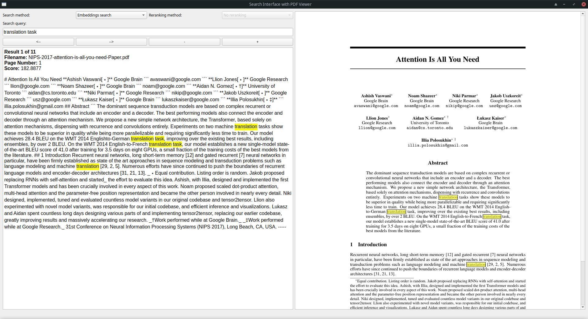

# BM25-PDF-Search
Create a knowledge base from PDF files and search it with BM25 algorithm.

# How it works
- install requirements:
  - ```pip install pymupdf4llm```
  - ```pip install PyQt5```
  - ```pip install Bm25s```
- copy ```chunk-pdf-pages.py``` to the folder with your library of PDF files.
- run ```chunk-pdf-pages.py``` script. The script will extract the text from the PDF files, chunking it in pages. The progress will be shown. If the script freezes is PymuPDF4LLM fault! (some PDF files cause this). If this happens, try to optimize the offending PDF files or try printing them to another PDF file or some other process that recreates or optimizes the PDF files. This process will create JSON files with the same filename of the source PDFs but with json extension (for example, test.pdf --> test.json). This file contains the extracted text from the PDF files, grouped in pages. This file must reside in the same folder as the source PDF.
- copy ```BM25-PDF-Search.py``` to the folder with your library of PDF files and json files.
- run ```BM25-PDF-Search.py``` script.
- the main window is has the following elements:
  - a search input box at the top. Input your search keywords here. Given how BM25 works, you have to type your keywords exactly as they could appear in the PDF file. So for example, searching for "dog" will not match "dogs" and vice versa. Try to expand your search keywords with singular/plural variants and synonyms. Press ENTER to search.
  - a text box to the left. The text from the most relevant match is shown there, along with the name of the source PDF file, the page where the match was found and the relative score (higher number --> more relevant result). You can use the "+" or "-" buttons to increase or decrease the font size. The search keywords are highlighted.
  - a graphics box to the right. This box shows the PDF file and it is synchronized to the left box. You can zoom in/zoom out using Ctrl-+ and Ctrl-- and reset the zoom with Ctrl-0. Left clicking on the PDF view will open the PDF file in the default PDF viewer.
  - a left "<--" and right "-->" buttons to navigate the results.

# Tips
- You can organize your PDF files in separate folders and have a copy of the ```BM25-PDF-Search.py``` script for each folder. By default the script only looks for json files in the current folder (not sub-folders).

# Screenshoot



